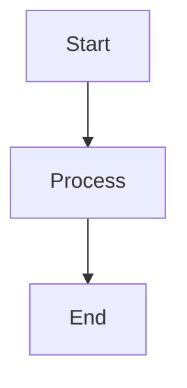

# ESE 2025 Presentation - AI Coding Agent Instructions

## Project Overview

This is a **Reveal.js-based presentation** for ESE Kongress 2025 about CI/CD evolution in the automotive industry. The presentation is titled "A CI Journey or Less Pipelines, More Happy Developers!" and documents the transformation from "Jenkinstein" (monolithic pipeline anti-pattern) to a clean Internal Developer Platform (IDP) for Software Product Line Engineering (SPLE).

**Key Point**: This is a presentation project, not a software product - all code examples in slides are illustrative, not executable parts of this repo.

## Architecture

### Single-File Presentation Structure

- **`index.html`**: Entry point loading Reveal.js framework with markdown plugin
- **`index.md`**: **ALL** presentation content in a single markdown file
  - Slides separated by `---` (horizontal slides)
  - Sub-slides separated by `--` (vertical slides)
  - Speaker notes in `Note:` blocks
  - Supports Mermaid diagrams and code syntax highlighting

**Critical**: Do NOT create separate slide files. All content goes in `index.md`.

### Development Server

Run with `npm run dev` which starts Vite on port 3000 with:

- Auto-reload on markdown/image changes (via custom Vite plugin `reload-on-file-change`)
- File watching with polling for dev container compatibility
- HMR overlay for errors

**Custom Vite Plugin**: The `reload-on-file-change` plugin in `vite.config.js` triggers full page reload for `.md` and image files, since markdown content is loaded dynamically and requires full refresh.

## Content Conventions

### Presentation Theme & Narrative

The presentation tells a **story arc** from problems to solutions:

1. Historical context (2005-2020s): "Continuous Kind im Brunnen" (reactive CI)
2. Failed attempts: Freestyle jobs, Groovy DSL, "Jenkinstein" monster
3. Breakthrough: Separation of concerns, local-first development
4. Solution: Thin pipelines + Pytest quality gates + CMake build system

### Technical Examples

When showing code in slides, use these authentic examples from the presentation:

**Bad Pattern (Jenkinstein)**:

- 10,000s lines of Groovy DSL in pipelines
- Business logic in CI instead of build system
- Non-reproducible failures locally

**Good Pattern (SPLE Platform)**:

```groovy
// Jenkins does ONLY orchestration
bat "call build.bat -selftests -marker 'build_debug or reports' || exit /b 1"
```

**Pytest Quality Gates**:

```python
@pytest.mark.build        # Build quality gate
@pytest.mark.unittests    # Unit test quality gate
```

### Slide Formatting

- Use `<!-- .element: ... -->` for reveal.js element attributes
- Use `Note:` blocks for speaker notes (these are presenter-only)
- German language for slide content, English for speaker notes
- Images from `images/` directory (use relative paths)

## Key Files to Reference

- **`CLAUDE.md`**: Comprehensive project documentation including full context, architecture principles, historical background
- **`docs/article/index.md`**: Conference proceedings article with technical depth and Mermaid diagrams
- **`index.md`**: The actual presentation slides (authoritative for current content)

## Editing Workflow

1. **Edit slides**: Modify `index.md` directly
2. **Test locally**: `npm run dev` auto-reloads on save
3. **Add images**: Place in `images/` directory, reference as `images/filename.png`
4. **Diagrams**: Use Mermaid syntax directly in markdown (plugin auto-renders)

## Common Tasks

### Adding a New Slide

Insert at appropriate position in `index.md` between `---` markers:

```markdown
---

### New Slide Title

- Bullet point
- Another point

Note:
Speaker notes here
```

### Adding Code Examples

Use fenced code blocks with language specification:

````markdown
```python
@pytest.mark.build
def test_build(self):
    # test code
```
````

### Adding Diagrams

Use Mermaid (loaded via CDN in `index.html`):

````markdown

````

```

## What NOT to Do

- ❌ Don't create separate slide files (this is NOT a multi-file slide deck)
- ❌ Don't modify `reveal.js/` directory (it's a git submodule)
- ❌ Don't add build logic (this is a presentation, not an app)
- ❌ Don't create test files (code examples are illustrative only)

## Context for AI Agents

**Audience**: Platform engineers, automotive software teams struggling with CI complexity

**Message**: Keep pipelines thin, put business logic in build systems, make everything reproducible locally

**Tone**: Conversational storytelling with technical depth - showing evolution from failures to success
```
