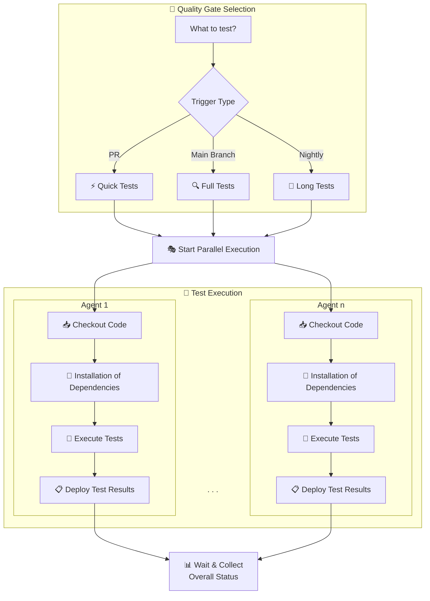

## Conference Proceedings Contribution

### Introduction

Continuous Integration (CI) and Platform Engineering are crucial in modern software development.
The automotive industry is no exception.
Automotive suppliers want to offer off-the-shelf products with high automation and short time-to-market, while OEMs demand unique selling points and different development process requirements.
The automotive industry's complex multi-tool landscape includes various V-Model test levels [1], numerous standards and regulations [2], each with their own tools and frameworks.
This raises a critical question: How can we ensure CI pipelines work efficiently while delivering fast, reliable feedback and maintaining understandability?
In this talk, we present our approach of an Internal Developer Platform (IDP) [3] for Software Product Line Engineering (SPLE) [4], built on Python [5], CMake [6] and Jenkins [7].
We share lessons learned from our CI journey, focusing on reduced pipeline complexity and improved developer happiness through clean dependency handling, unified build systems, and reproducible Pytest-based quality gates that work identically on developer machines and in CI environments.

### Our CI Journey

Our CI journey spans over two decades, beginning in 2005 in the automotive industry where we encountered what we now call "Continuous Kind im Brunnen" (Continuous "Child in the Well") - a reactive approach where the only quality criterion was simply "software linkable" and developers only received feedback the next day after nightly builds failed. Starting with an RCS-based source code repository supporting hundreds of developers across multiple customer projects, we relied on a proprietary build automation server for remote builds, with no unit tests and testing primarily conducted through integration tests and vehicle trials.

Our first improvement attempt introduced unit testing with a custom CUnit-based framework and Jenkins, but we made the critical mistake of creating a separate build environment instead of integrating with existing infrastructure. As other departments demanded automation, we implemented freestyle jobs for every test level (Software-In-the-Loop, Hardware-In-the-Loop, etc.), creating a fragmented landscape without true continuous integration or quality gates

The evolution continued with centralizing CI configuration in a separate Git repository containing JSON files to orchestrate Jenkins pipelines, followed by migrating to GitHub Enterprise for webhook-driven triggers. However, this led to our biggest architectural mistake: implementing all quality gate business logic within Jenkins pipeline DSL (Groovy), creating thousands of lines of complex, unmaintainable code that became our "Jenkinstein" - a monster that served as build system, test system, deployment system, and monitoring system all in one.

The breaking point came when we realized the fundamental flaw: build failures were non-reproducible locally, debugging was nearly impossible, and two Scrum teams spent 50% of their time on maintenance. This led to our architectural renaissance, where we established clear separation between pipeline orchestration, test logic for quality gates, and the build system itself.

### Our Solution

Our solution addresses the core problem of CI/local environment mismatch through clear architectural separation and unified tooling.
The key insight was recognizing that CI and local environments differ primarily in orchestration, not in actual build and test execution.
With this understanding, we derived the following **architecture principles**:

- **Separation of Concerns**: Pipeline logic handles only orchestration; all business logic resides in the build system
- **Local-First Development**: Jenkins executes identical commands that developers run locally
- **Bootstrapping**: build scripts handle all dependency resolution and tool installation
- **Unified Build System**: CMake as meta-build system with ninja for performance, building all artifacts of all variants
- **Quality Gates**: Pytest as universal test framework for all quality gates, executing and testing all required build targets

With these principles in mind, we designed a modular Internal Developer Platform (IDP) for Software Product Line Engineering (SPLE).
We named our approach SPLE Platform with the goal to supporting the following **Main Features**:

- **Shift Left**: Tests as early as possible in the development process
- **Continuous Integration**: Fast feedback on pull requests and develop branch
- **Reuse**: Support for multiple customer projects with shared components and variant management
- **Automation**: Automated creation of all required build artifacts and reports

Our SPLE Platform provides a modular software development environment with an **Implementation Stack** consisting of:

- **Scoop** [8]: Windows package manager for toolchain installation
- **CMake + Ninja**: Build system generator and fast build system
- **Python + Pytest**: Unified test framework with markers for different quality gate types (@pytest.mark.build, @pytest.mark.unittests)
- **Thin Jenkins Pipeline**: Minimal orchestration calling pytest with appropriate markers based on trigger type
- **Quality Gates as Test Selection**: Each quality gate is simply a pytest marker selection (quick for pull requests, full for develop branch, extended for nightly)

To illustrate our approach of quality gates, Figure 1 shows a flow chart of our unified SPLE pipeline with quality gate selection and test execution.
This pipeline simply selects a quality gate as set of markers based on the trigger type (pull request, main branch push, nightly build) and orchestrates parallel execution across multiple agents.



Here is an example of how we structure tests for a variant "MyVariant" as a Pytest class using markers:

```python
class Test_MyVariant:
    variant = "MyVariant"

    @pytest.mark.build
    def test_build(self):
        # Arrange
        spl_build: SplBuild = SplBuild(variant=self.variant, build_kit="prod", target="build")

        # Act
        result = spl_build.execute()

        # Assert
        assert result == 0, "Building failed"

    @pytest.mark.unittests
    def test_unittests(self):
        # Arrange
        spl_build: SplBuild = SplBuild(variant=self.variant, build_kit="test", target="unittests")

        # Act
        result = spl_build.execute()

        # Assert
        assert result == 0, "Building failed"
```

This approach transforms quality gates from opaque pipeline magic into transparent, reproducible test selections that work identically across all environments.

Another key insight was to treat the platform itself as a **product**, developed collaboratively within an **Agile Release Train** following the **Scaled Agile Framework (SAFe)** [9]. This marked a major shift from fragmented, tool-specific automation efforts to a unified, organization-wide initiative.

By coining a clear name and vision for the platform, we gave all contributors, from developers to platform engineers and management, a shared sense of ownership.
Every team now contributes features, feedback, and improvements through regular sprint reviews, ensuring the platform evolves with real user needs.

Management actively supports the initiative from a business perspective by allocating dedicated budgets for training, licenses, and infrastructure.
This alignment between technical teams and leadership transforms the platform from an ad-hoc engineering effort into a sustainable, strategic product that integrates seamlessly across all tools and test levels.

### Conclusion

With the presented solution of a modular SPLE Platform built on Python, CMake, and Jenkins, we have successfully transformed our CI journey from a fragmented, unmaintainable "Jenkinstein" into a streamlined, developer-friendly environment that delivers fast, reliable feedback across all test levels. The main benefits realized through this approach for different stakeholders include:

- **Developers**: Same commands work locally and in CI; easy debugging of failures; fast feedback
- **Platform Engineers**: Maintainable Python code instead of complex DSL; reusable components across SPLs
- **Management**: Fast, reliable feedback; transparent quality criteria; always releasable software state

### References

[1] ASPICE: https://vda-qmc.de/en/automotive-spice/

[2] ISO26262: https://en.wikipedia.org/wiki/ISO_26262

[3] Internal Developer Platform (IDP): https://en.wikipedia.org/wiki/Internal_developer_platform

[4] Software Product Line Engineering (SPLE): https://en.wikipedia.org/wiki/Software_product_line

[5] Pytest: https://docs.pytest.org/en/

[6] CMake: https://cmake.org/

[7] Jenkins: https://www.jenkins.io/

[8] Scoop: https://scoop.sh/

[9] Scaled Agile Framework (SAFe): https://www.scaledagileframework.com/
