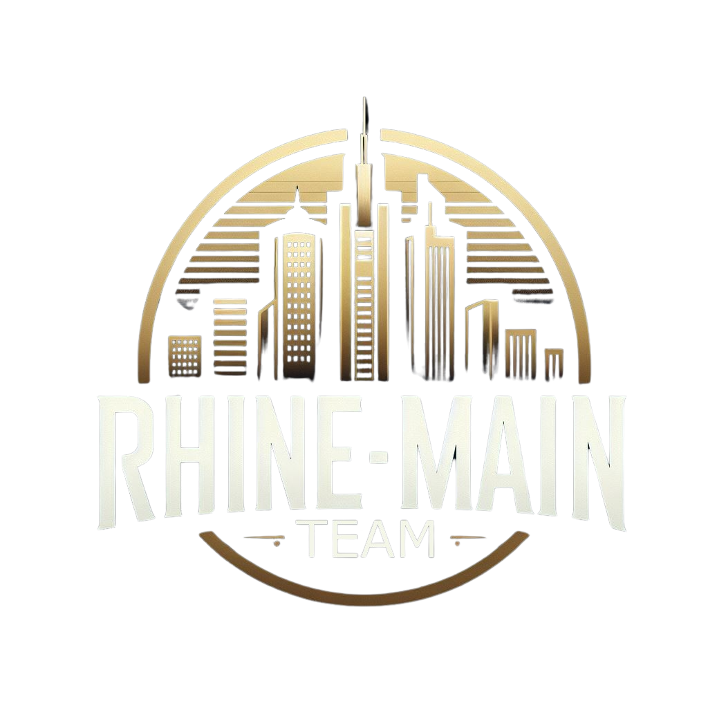
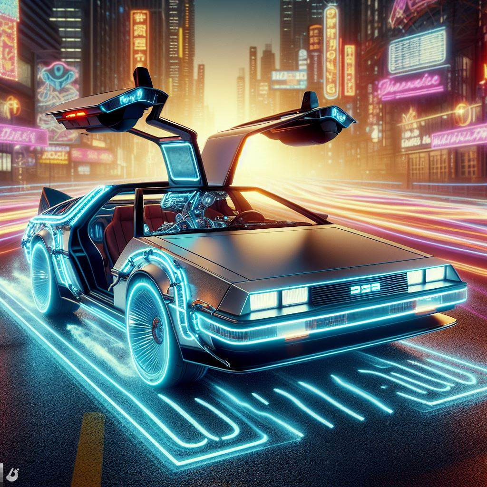
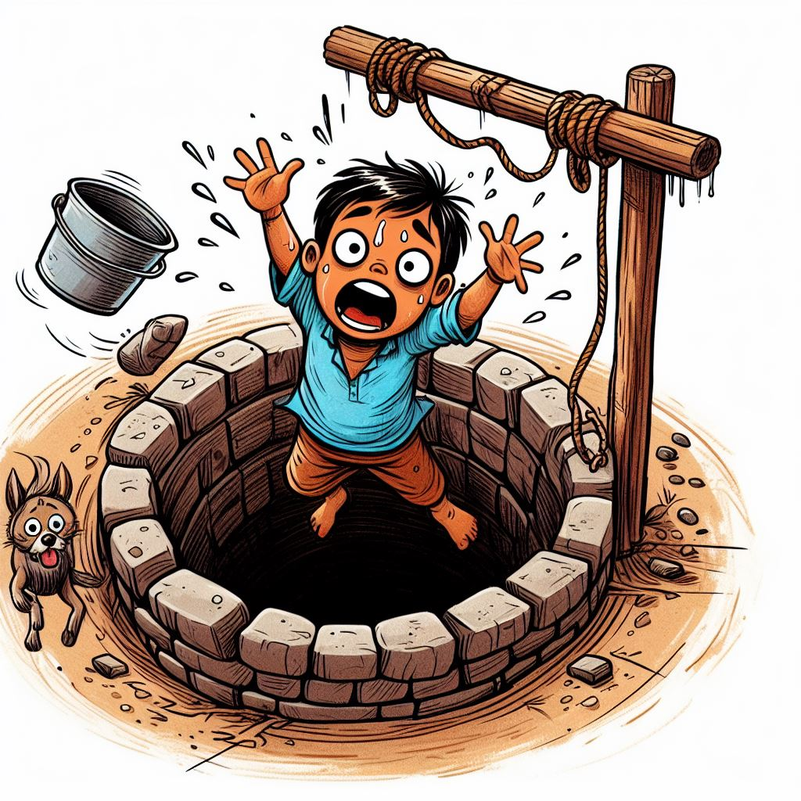
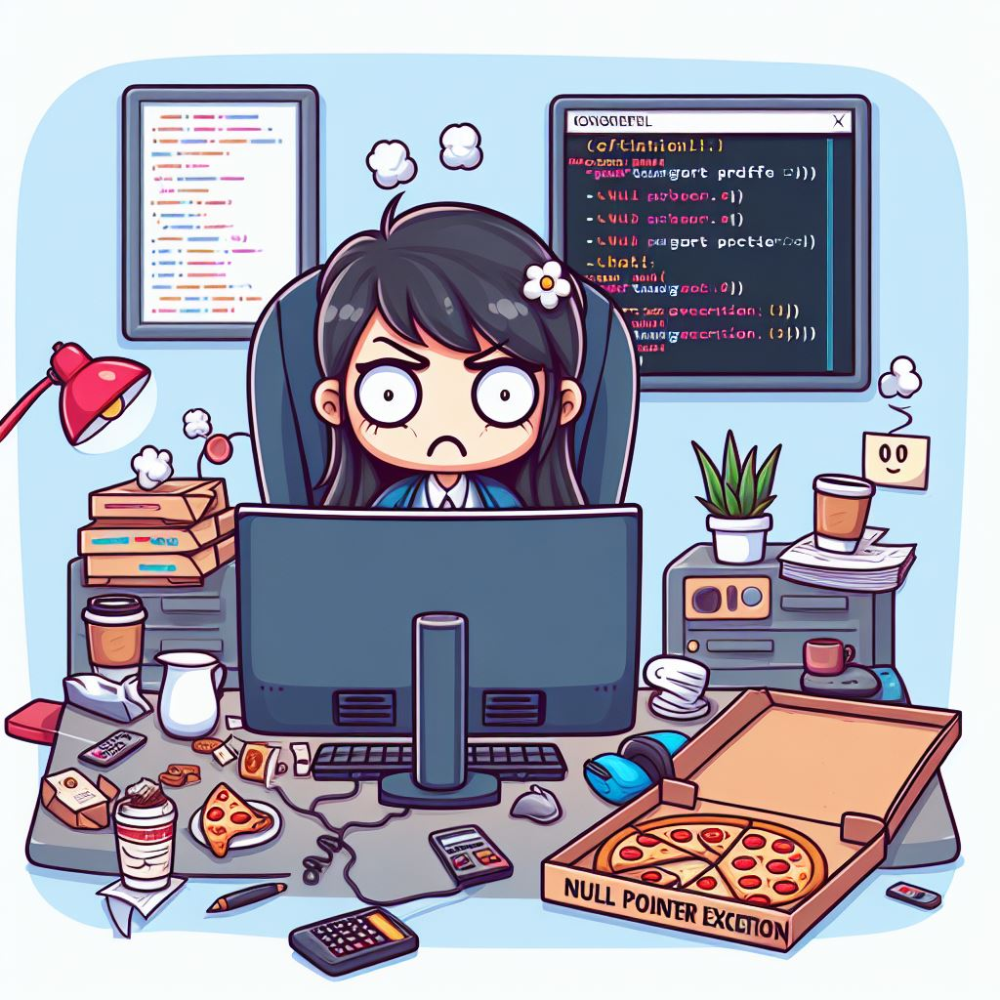
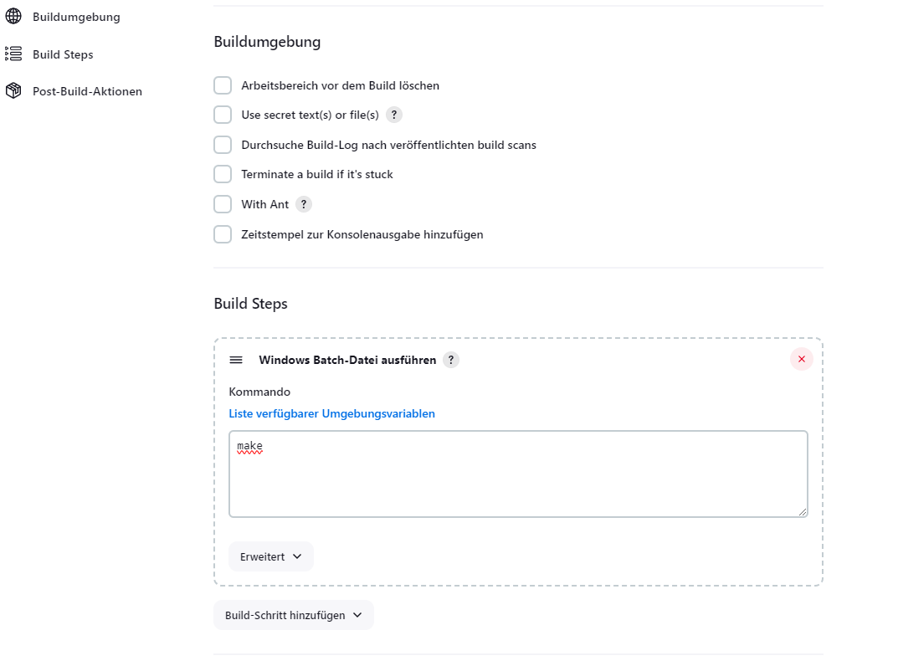
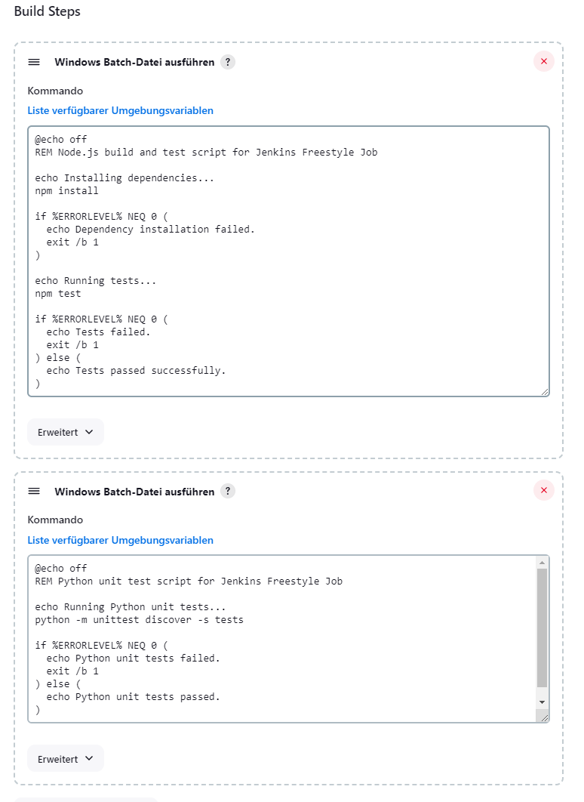
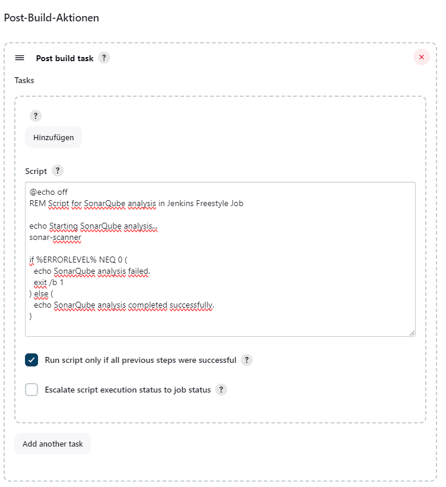
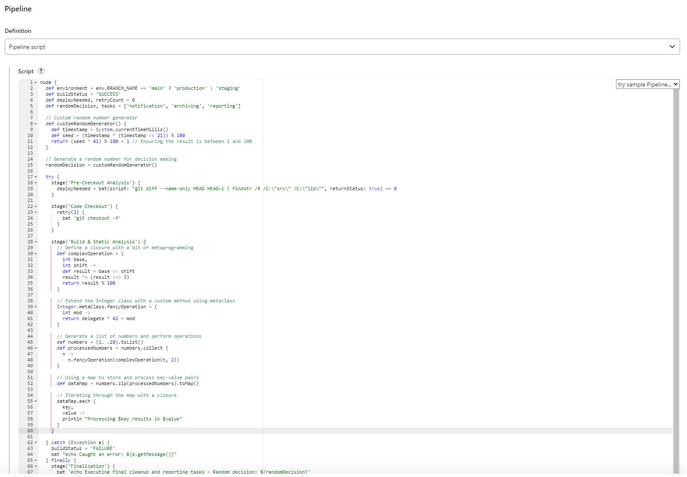
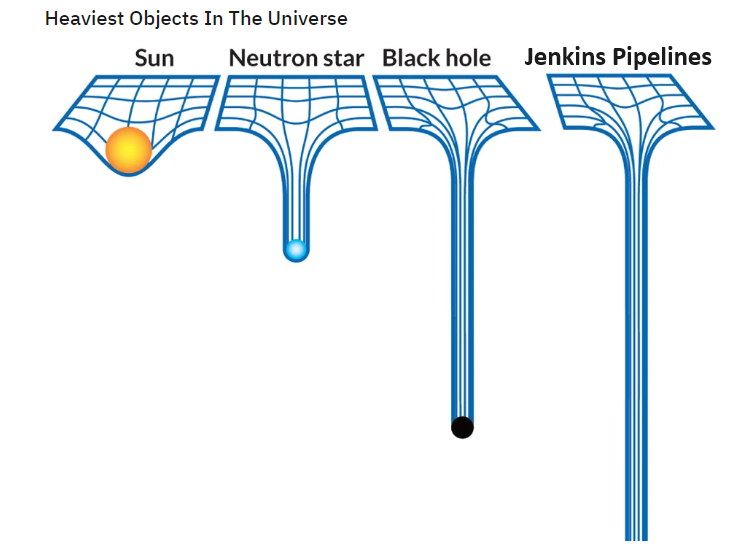

## A CI Journey

or

Less Pipelines, More Happy Developers!

<hr>

ESE Kongress 2025 in Sindelfingen



<!-- .element: style="float: left; height: 180px" -->


<!-- .element: style="float: right; height: 180px" -->

Note:

Hello everyone and welcome to my talk about CI/CD. Today I'd like to take you on a journey that I started more than 10 years ago. A journey that has led me through many different projects and companies. A journey that taught me that it's not just about automation, but also about the joy of developing software. (Anecdote: Back to the Future)

---

### Who are we?

<div>


[Karsten](https://www.linkedin.com/in/karnangue/)

</div> <!-- .element: style="float: left; width: 30%" -->

<div>


[Alexandru](https://www.maxiniuc.com/)

</div> <!-- .element: style="float: right; width: 30%;" -->

Note:

Okay, so who are we actually?

Alexandru has nearly 20 years of experience in the automotive industry, specializing in safety-critical embedded software for braking systems.

He's passionate about build systems and Software Product Line Engineering.

He currently works as a Senior Platform Engineer in the Rhine-Main Team at Marquardt GmbH.

I myself have been working as a software developer for over 25 years.

From Ada, Embedded C, C++, Perl, Tcl, Python, to developing dev tools and Jenkins pipelines - I've seen and done a lot.

Currently, I work as a Platform Engineer in the Rhine-Main team at Marquardt GmbH.

There it's all about Software Product Lines, internal developer platforms, automation, and CI/CD.

He has extensive experience developing CI methods, tools, and pipelines.

He currently works as a platform architect in the Rhine-Main Team at Marquardt GmbH, focusing on internal development platforms and Software Product Line Engineering.

---

### Where do we come from?

Back to 2005 <!-- .element: class="fragment" data-fragment-index="1" -->

 <!-- .element width="50%" class="fragment" data-fragment-index="1" -->

Note:

Where do we actually come from?

_click_

For that, we need to go back a bit into the past, specifically to the year 2005.

That's when I started as a newcomer in the automotive industry.

--

### The Automotive Industry

- Exciting products <!-- .element: class="fragment" -->
- Constantly new requirements <!-- .element: class="fragment" -->
- Well-paid jobs <!-- .element: class="fragment" -->
- Paradise for SW developers <!-- .element: class="fragment" -->

Note:

What was it like back then in the automotive industry?

Actually, pretty much the same as today.

_click_

Exciting products: brake control units, ESP, ABS, ACC, ...

_click_

Constantly new requirements, as many customers want to stand out from the competition.

_click_

The jobs were well paid.

_click_

Actually paradise for SW developers.

--

### The Job

- SW development for brake control units <!-- .element: class="fragment" -->
- Embedded C? We had that at university! <!-- .element: class="fragment" -->
- It's your code, but don't you dare change anything! <!-- .element: class="fragment" -->
- Always remember: don't break the build! <!-- .element: class="fragment" -->
- Nothing is too difficult for an engineer! <!-- .element: class="fragment" -->

Note:

And the job?

_click_

Sure, we're coding Embedded C for brake control units.

_click_

No problem, we had that at university.

_click_

Here came the first damper.

You got responsibility for a part of the code, but ideally you shouldn't change it.

_click_

Why? Don't break the build!

_click_

Sounded difficult, but we had learned at university: Nothing is too difficult for an engineer!

--

### The Starting Point

- No unit tests <!-- .element: class="fragment" -->
- No CI, only nightly builds <!-- .element: class="fragment" -->
- Many integration tests, mainly vehicle trials <!-- .element: class="fragment" -->
- Code reuse across all projects <!-- .element: class="fragment" -->
- Several hundred developers worldwide working on one codebase <!-- .element: class="fragment" -->

Note:

The starting point?

_click_

Oops, no unit tests.

Not a single line of test code in the repository.

Sure, where do you test brakes? In the car.

_click_

Well, some SIL and HIL was done.

_click_

But most of it was tested in driving tests.

So many features were tested at some point, somewhere in some project.

Hence the motto: better not change anything.

_click_

But how is that supposed to work when the code is shared across all projects,

all customers come around the corner with new requirements..

_click_

and several hundred developers worldwide are working on one codebase?

--

<!-- .slide: data-visibility="hidden" -->

### The Tools

- MKS / PTC Integrity or "RCS on Steroids" <!-- .element: class="fragment" -->
- GNU Make / MSYS in Java GUI on Windows 2000 <!-- .element: class="fragment" -->
- Build Server on ESX / VMWare <!-- .element: class="fragment" -->
  - Remote Builds <!-- .element: class="fragment" -->
  - Nightly Builds <!-- .element: class="fragment" -->

Note:

- Users could trigger remote builds via GUI
- Nightly builds ran automatically

--

### Continuous What?

 <!-- .element: width="40%" class="fragment" data-fragment-index="1" -->

Continuous "Child in the Well" <!-- .element: class="fragment" data-fragment-index="1" -->

Note:

When someone asks me today what Continuous Integration is, I like to remember that time.

About what Continuous Integration is absolutely NOT.

At some point, I came up with a fitting name for the situation back then:

_click_

Continuous "Child in the Well".

What does that mean exactly?

1. Highest quality criterion: SW linkable.
2. Some project is always red (compile or link errors)
3. No test automation
4. No unit tests
5. Developers are evil, they build bugs into the code.

And how did you feel as a developer?

_click_

---

### We need to change something!

But what? <!-- .element: class="fragment" -->

Note:

Well, we need to change something! But what?

_click_

This is where our CI journey really begins.

Namely with the development of our Automotive Software Factory.

The name came later, but there were plenty of ideas.

--

SW changes only until noon, then bugfixing and vehicle tests.

 <!-- .element: width="80%"  class="fragment" data-fragment-index="1" -->

Note:

One idea was ...

You can imagine how thrilled the developers were.

_click_

Especially considering the question of what noon means at an international corporation working worldwide.

This idea didn't really work.

What else can you do?

--

### Unit Testing is a good start.

- With our own framework based on CUnit <!-- .element: class="fragment" -->
- Automatic generation of mockups <!-- .element: class="fragment" -->
- Test Driven Development (TDD) <!-- .element: class="fragment" -->
- Nightly tests on Jenkins (and Hudson!) <!-- .element: class="fragment" -->

Note:

Sure, if you don't have unit tests, that's always a good start.

However, it wasn't that easy to make our code testable.

_click_

We built our own framework based on CUnit.

_click_

The automatic generation of mockups was a big success back then.

Writing mockups manually (especially in the era of Autosar) was simply too time-consuming and a major hurdle for developers.

_click_

We tried from the beginning to establish Test Driven Development based on requirements.

_click_

And of course, if you have unit tests, you want to run them automatically.

--

### Continuous Integration sounds nice too.

- Gerrit and Jenkins for tools <!-- .element: class="fragment" -->
- Feature-based testing via commit comments <!-- .element: class="fragment" -->
- SW development still on RCS. <!-- .element: class="fragment" -->
- CI with RCS? Yes, we can! <!-- .element: class="fragment" -->

Note:

Well, we have a Jenkins and some unit tests.

Let's do CI!

_click_

...

--

## No git? <!-- .element: class="r-fit-text" -->

## No mercy! <!-- .element: class="r-fit-text fragment" style="color:red" -->

Note:

What? No Git? You're doing CI with RCS?

_click_

Sorry, but there's no mercy then!

You're on your own!

And that's how it was. We never got away from nightly builds.

Our CI solution ran in parallel to nightly builds.

--

### Our Dream: The Software Factory

 <!-- .element height="50%" width="50%" -->

--

### Jenkins School of Witchcraft and Wizardry

 <!-- .element height="50%" width="50%" -->

Note:

The monster that came out of it was a Jenkins that could do everything.

The Jenkinstein.

Instead of having a unified build system including pipeline, we had a multitude of jobs that were all somehow connected.

We abused Jenkins as a build system, as a test system, as a deployment system, as a monitoring system.

Everything our build system couldn't do, we packed into Jenkins pipelines.

- The crux with Jenkins pipelines
  - Java developers who just want to program Java
  - And then aren't allowed to!
  - Many misunderstandings about what runs where
  - Nobody understands how the pipeline works anymore.
  - Nobody can debug.
  - Nobody can follow it.
  - Anti-pattern of CI.
- 2 Scrum teams were at least 50% occupied with maintenance.
- The "Service Card" was being passed around.

--

### The Infrastructure

- On-premise Jenkins with 500 static VMs <!-- .element: class="fragment" -->
- Micro services for reporting and artifact storage <!-- .element: class="fragment" -->
- Combination of CI/CD, nightly builds and on-demand builds <!-- .element: class="fragment" -->

--

<!-- .slide: data-visibility="hidden" -->

### A User's Perspective:

"My component is so complex and can only be tested completely in the integrated system. I don't care if there are 10 or 100 customer projects, the Software Factory must be able to handle that."

--

<!-- .slide: data-visibility="hidden" -->

### The Salvation: GitHub Enterprise

- ... was no salvation. <!-- .element: class="fragment" -->
- Mono-repo didn't scale. <!-- .element: class="fragment" -->
- Test effort for every change too high. <!-- .element: class="fragment" -->
- 24/7 utilization of build agents <!-- .element: class="fragment" -->
- Sometimes nightly builds had to wait for the previous one <!-- .element: class="fragment" -->
- Can you still call them nightly builds at 24h? <!-- .element: class="fragment" -->
- Web portal to display build results (always red) <!-- .element: class="fragment" -->

--

<!-- .slide: data-visibility="hidden" -->

### And what about the Tool Department?

- Tool dependency handling with custom package manager (hack in Java) <!-- .element: class="fragment" -->
- Hybrid cloud: on-premise and AWS/EC2 <!-- .element: class="fragment" -->
- 2 Scrum teams were at least 50% occupied with maintenance. <!-- .element: class="fragment" -->
- The "Service Card" was being passed around. <!-- .element: class="fragment" -->
- GitHub Enterprise instance constantly at its limit. <!-- .element: class="fragment" -->

---

### What did we actually do wrong?

Note:

At first, everything went well ...

--

### Freestyle Happiness

 <!-- .element width="80%" -->

Note:

Sure, when you start with Jenkins, you begin with simple freestyle jobs.

Just building.

--

### Freestyle Faith

<div style="position:relative; width:900px; height:600px; margin:0 auto;">
    
    
</div>

Note:

- then suddenly a bit more happens
- gradually tools need to be glued together
- Connection to the SCM system
- Reporting

--

### Holy Moly Groovy Pipelines

 <!-- .element width="80%" -->

--

 <!-- .element width="65%" -->

Note:
Higher, faster, further: One pipeline to rule them all.

--

### Law of the Instrument

- Pipeline as replacement build system <!-- .element: class="fragment" -->
- Build logic in pipelines (10,000s of lines of Groovy DSL) <!-- .element: class="fragment" -->
- Sufficient? No! Shared libraries and plugins still exist ... <!-- .element: class="fragment" -->
- Non-reproducible CI results <!-- .element: class="fragment" -->
- Worst case: separate repos for product source code and CI pipeline <!-- .element: class="fragment" -->

Note:

- CI system does different/more things than the build environment.
- With a hammer in hand, the world looks like a pile of nails.
- Birmingham screwdriver

--

### Continuous Complexity

 <!-- .element width="60%" style="filter: invert(100%)" -->

---

### How to do it better?

- <!-- .element: class="fragment" --> Pipeline as Code
- <!-- .element: class="fragment" --> Dependencies as Code
- <!-- .element: class="fragment" --> Quality Checks as Code
- <!-- .element: class="fragment" --> Everything else as Code

Note:

--

### Pipeline Happiness?

- Checkout from repository<!-- .element: class="fragment" -->
- Installation of all dependencies <!-- .element: class="fragment" -->
- Execute selected tests as quality checks <!-- .element: class="fragment" -->
- Archive results <!-- .element: class="fragment" -->

--

### Jenkins

<div style="font-size: xx-large">

```Groovy
...

node() {
    stage("Checkout Code") {
        checkout scm
    }

    stage("Installation of Dependencies") {
        bat "call build.bat -install -installOptional || exit /b 1"
    }

    stage ("Execute Tests") {
        bat "call build.bat -selftests -marker 'build_debug or reports' || exit /b 1"
    }

    stage("Deploy Test Results") {
        junit allowEmptyResults: false, keepLongStdio: false, testResults: "test/output/test-report.xml"
    }

    ...
}

...
```

</div>

--

### GitHub Actions

<div style="font-size: xx-large">

```yaml
---
jobs:
  test:
    name: CI Gate
    runs-on: windows-latest

    steps:
      - name: Checkout Code
        uses: actions/checkout@v4
        with:
          fetch-depth: 0
      - name: Installation of Dependencies
        run: |
          .\build.ps1 -install
        shell: powershell
      - name: Execute Tests
        run: |
          .\build.ps1 -selftests -marker "build_debug or reports"
        shell: powershell
      - name: Deploy Test Results
        uses: EnricoMi/publish-unit-test-result-action/windows@v2
        if: always()
        with:
          files: |
            test/output/test-report.xml
```

</div>

--

<!-- .slide: data-visibility="hidden" -->

### SPLE Platform

- VSCode plus CMake Tools
- Configuration as Code
- Easily extensible
- SPLE enables modular SW development
- Components as building blocks of the software
- Separate repositories thanks to RTE interfaces
- Custom configuration
- Variant-independent unit tests
- Separation of customer and developer view
- Integration tests of components possible

--

### Jenkins

- does NOTHING different than the user locally <!-- .element: class="fragment" -->
- Build is a one-liner <!-- .element: class="fragment" -->
- Automatic job creation for branches and pull requests <!-- .element: class="fragment" -->
- Few plugins to display results <!-- .element: class="fragment" -->
- Supporting developers in analyzing errors <!-- .element: class="fragment" -->

Note:

- https://www.jenkins.io/doc/book/pipeline/pipeline-best-practices/
- Minimal Jenkinsfile plus Organization Folder Plugin (Bitbucket, GitHub)
- A single config file (config.xml of the org)

--

<!-- .slide: data-visibility="hidden" -->

### Reporting

- Less is more
- No database
- Don't build your own results portal
- Jenkins + Artifactory and done
