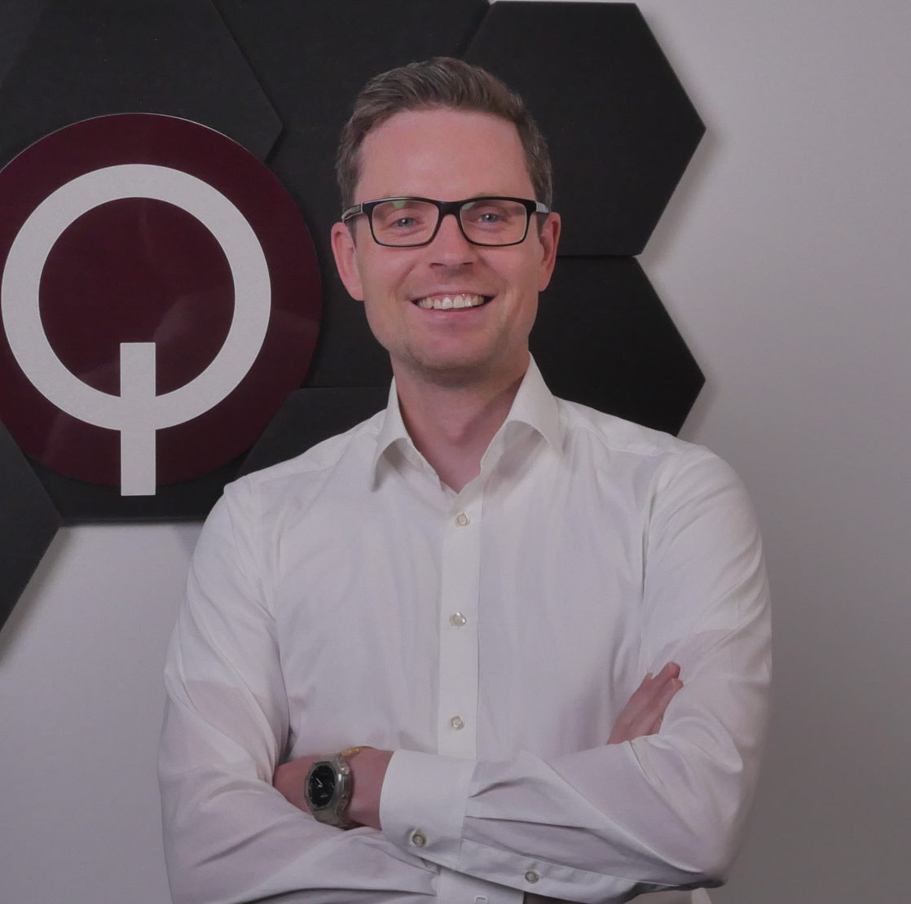
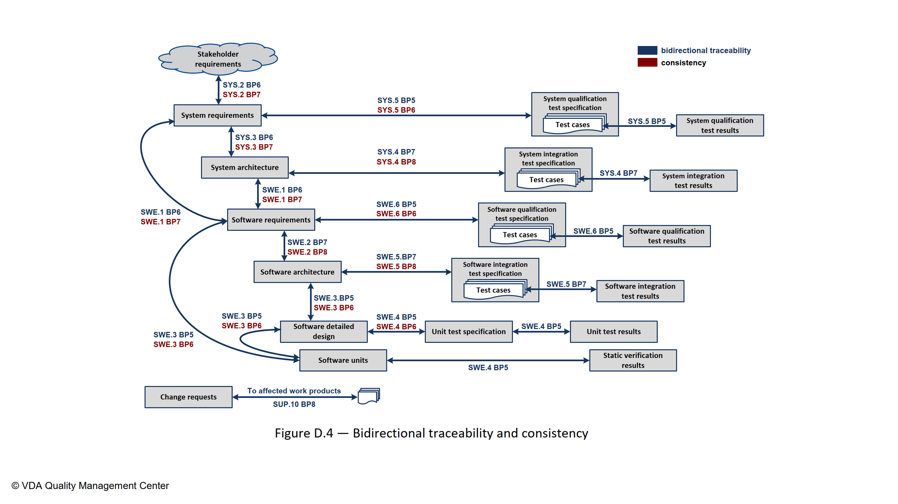
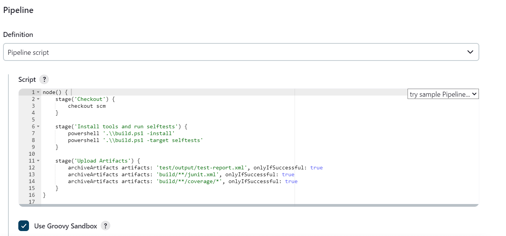
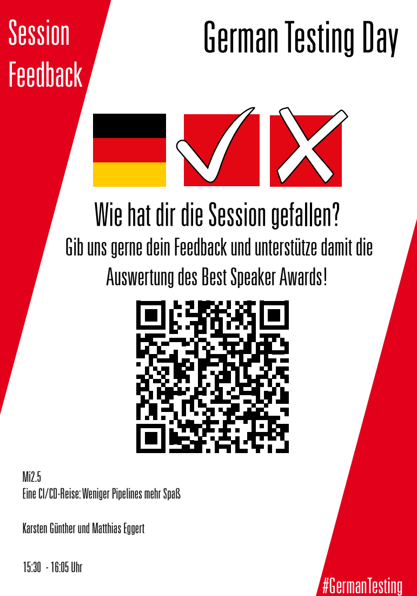

## A CI Journey

or

Less Pipelines, More Happy Developers!

Note:

Hello everyone and welcome to my talk about CI/CD. Today I'd like to take you on a journey that I started more than 10 years ago. A journey that has led me through many different projects and companies. A journey that taught me that it's not just about automation, but also about the joy of developing software. (Anecdote: Back to the Future)

---

## Who are we?

[Karsten](https://www.linkedin.com/in/karnangue/)

 <!-- .element: style="float: left; width: 30%" -->

[Matthias](https://www.linkedin.com/in/matthias-eggert-b7939a18a/)

 <!-- .element: style="float: right; width: 40%;" -->

Note:

Okay, so who are we actually?

Matthias worked for several years in the automotive industry as a software integrator, software developer, and DevOps engineer.

He always worked on safety-critical functions like braking systems or battery management systems.

We worked together at Continental about 8 years ago and then moved to Marquardt at the same time.

There we worked together on our solution for Software Product Line Engineering, which will only be touched on peripherally today.

He now works as a DevOps Engineer and test automation specialist at Qytera GmbH.

I myself have been working as a software developer in the automotive sector for over 18 years.

From Ada, Embedded C, C++, Perl, Tcl, Python, to developing dev tools and Jenkins pipelines - I've seen and done a lot.

Currently, I work as a Platform Engineer in the Rhine-Main team at Marquardt GmbH.

There it's all about Software Product Lines, internal developer platforms, automation, and CI/CD.

---

## Where do we come from?

Back to 2005 <!-- .element: class="fragment" data-fragment-index="1" -->

 <!-- .element width="50%" class="fragment" data-fragment-index="1" -->

Note:

Where do we actually come from?

*click*

For that, we need to go back a bit into the past, specifically to the year 2005.

That's when I started as a newcomer in the automotive industry.

--

## The Automotive Industry

- Exciting products <!-- .element: class="fragment" -->
- Constantly new requirements <!-- .element: class="fragment" -->
- Well-paid jobs <!-- .element: class="fragment" -->
- Paradise for SW developers <!-- .element: class="fragment" -->

Note:

What was it like back then in the automotive industry?

Actually, pretty much the same as today.

*click*

Exciting products: brake control units, ESP, ABS, ACC, ...

*click*

Constantly new requirements, as many customers want to stand out from the competition.

*click*

The jobs were well paid.

*click*

Actually paradise for SW developers.

--

## The Job

- SW development for brake control units <!-- .element: class="fragment" -->
- Embedded C? We had that at university! <!-- .element: class="fragment" -->
- It's your code, but don't you dare change anything! <!-- .element: class="fragment" -->
- Always remember: don't break the build! <!-- .element: class="fragment" -->
- Nothing is too difficult for an engineer! <!-- .element: class="fragment" -->

Note:

And the job?

*click*

Sure, we're coding Embedded C for brake control units.

*click*

No problem, we had that at university.

*click*

Here came the first damper.

You got responsibility for a part of the code, but ideally you shouldn't change it.

*click*

Why? Don't break the build!

*click*

Sounded difficult, but we had learned at university: Nothing is too difficult for an engineer!
--

## The Starting Point

- No unit tests <!-- .element: class="fragment" -->
- A bit of SIL and HIL <!-- .element: class="fragment" -->
- Lots of driving tests <!-- .element: class="fragment" -->
- Code reuse across all projects <!-- .element: class="fragment" -->
- Several hundred developers worldwide on one codebase <!-- .element: class="fragment" -->

Note:

The starting point?

*click*

Oops, no unit tests.

Not a single line of test code in the repository.

Sure, where do you test brakes? In the car.

*click*

Well, some SIL and HIL was done.

*click*

But most of it was tested in driving tests.

So many features were tested at some point, somewhere in some project.

Hence the motto: better not change anything.

*click*

But how is that supposed to work when the code is shared across all projects,

all customers come around the corner with new requirements..

*click*

and several hundred developers worldwide are working on one codebase?

--

<!-- .slide: data-visibility="hidden" -->

## Die Tools

- MKS / PTC Integrity oder "RCS on Steroids" <!-- .element: class="fragment" -->
- GNU Make / MSYS in Java GUI auf Windows 2000 <!-- .element: class="fragment" -->
- Build Server auf ESX / VMWare <!-- .element: class="fragment" -->
  - Remote Builds <!-- .element: class="fragment" -->
  - Nightly Builds <!-- .element: class="fragment" -->

Note:
- User konnte remote Builds per GUI triggern
- Nightly Builds automatisch

--

## Continuous What?

 <!-- .element: width="40%" class="fragment" data-fragment-index="1" -->

Continuous "Child in the Well" <!-- .element: class="fragment" data-fragment-index="1" -->

Note:

When someone asks me today what Continuous Integration is, I like to remember that time.

About what Continuous Integration is absolutely NOT.

At some point, I came up with a fitting name for the situation back then:

*click*

Continuous "Child in the Well".

What does that mean exactly?

1. Highest quality criterion: SW linkable.
2. Some project is always red (compile or link errors)
3. No test automation
4. No unit tests
5. Developers are evil, they build bugs into the code.

And how did you feel as a developer?

*click*

--

<!-- .slide: data-visibility="hidden" -->

## Der Prozess: ASPICE

 <!-- .element width="80%" -->

Note:
- wird nur als Last angesehen
- Entwicklung läuft richtig, da muss nichts geändert werden.
- Wer soll die ganzen Dokumente erzeugen?
- So viel Zeit haben wir gar nicht.

--

 <!-- .element width="65%" -->

Note:

Like in the valley of tears.

---

## We need to change something!

### But what?

Automotive Software Factory (2011-2021) <!-- .element: class="fragment" -->

Note:

Well, we need to change something! But what?

*click*

This is where our CI journey really begins.

Namely with the development of our Automotive Software Factory.

The name came later, but there were plenty of ideas.

--

SW changes only until noon, then bugfixing and testing in driving tests.

 <!-- .element: width="40%"  class="fragment" data-fragment-index="1" -->

Note:

One idea was ...

You can imagine how thrilled the developers were.

*click*

Especially considering the question of what noon means at an international corporation working worldwide.

This idea didn't really work.

What else can you do?

--

## Unit Testing is a good start.

- With our own framework based on CUnit <!-- .element: class="fragment" -->
- Automatic generation of mockups <!-- .element: class="fragment" -->
- Test Driven Development (TDD) <!-- .element: class="fragment" -->
- Nightly tests on Jenkins (and Hudson!) <!-- .element: class="fragment" -->

Note:

Sure, if you don't have unit tests, that's always a good start.

However, it wasn't that easy to make our code testable.

*click*

We built our own framework based on CUnit.

*click*

The automatic generation of mockups was a big success back then.

Writing mockups manually (especially in the era of Autosar) was simply too time-consuming and a major hurdle for developers.

*click*

We tried from the beginning to establish Test Driven Development based on requirements.

*click*

And of course, if you have unit tests, you want to run them automatically.

--

## Continuous Integration sounds nice too.

- Gerrit and Jenkins for tools <!-- .element: class="fragment" -->
- Feature-based testing via commit comments <!-- .element: class="fragment" -->
- SW development still on RCS. <!-- .element: class="fragment" -->
- CI with RCS? Yes, we can! <!-- .element: class="fragment" -->

Note:

Well, we have a Jenkins and some unit tests.

Let's do CI!

*click*

...

--

## No git? <!-- .element: class="r-fit-text" -->

## No mercy! <!-- .element: class="r-fit-text fragment" style="color:red" -->

Note:

What? No Git? You're doing CI with RCS?

*click*

Sorry, but there's no mercy then!

You're on your own!

And that's how it was. We never got away from nightly builds.

Our CI solution ran in parallel to nightly builds.

--

What we wanted to create:

 <!-- .element height="60%" width="60%" -->

--

The monster that came out of it:
 <!-- .element height="50%" width="50%" -->

Note:

The monster that came out of it was a Jenkins that could do everything.

The Jenkinstein.

Instead of having a unified build system including pipeline, we had a multitude of jobs that were all somehow connected.

We abused Jenkins as a build system, as a test system, as a deployment system, as a monitoring system.

Everything our build system couldn't do, we packed into Jenkins pipelines.

--

Jenkins School of Witchcraft and Wizardry

 <!-- .element height="60%" width="60%" -->

Note:

- The crux with Jenkins pipelines
  - Java developers who just want to program Java
  - And then aren't allowed to!
  - Many misunderstandings about what runs where
  - Nobody understands how the pipeline works anymore.
  - Nobody can debug.
  - Nobody can follow it.
  - Anti-pattern of CI.
- 2 Scrum teams were at least 50% occupied with maintenance.
- The "Service Card" was being passed around.

--

<!-- .slide: data-visibility="hidden" -->

### Thema: Skalierbarkeit

- Klassische IT hat ESX / VMWare im Bauchladen <!-- .element: class="fragment" -->
- 500 Statische Windows Server VMs <!-- .element: class="fragment" -->
- 2 Millionen Euro in Bare-Metal versenkt <!-- .element: class="fragment" -->
- Kombination von CI/CD, Nightly Builds und on-demand Builds <!-- .element: class="fragment" -->

--

<!-- .slide: data-visibility="hidden" -->

### Die Sicht eines Anwenders:

"Meine Komponente ist so komplex und kann nur komplett im Verbund getestet werden. Ist mir egal, ob es 10 oder 100 Kundenprojekte gibt, das muss die Software Factory können."

--

<!-- .slide: data-visibility="hidden" -->

### Die Erlösung: GitHub Enterprise

- ... ist keine Erlösung. <!-- .element: class="fragment" -->
- Mono-Repo skalierte nicht. <!-- .element: class="fragment" -->
- Testaufwand für jede Änderung zu hoch. <!-- .element: class="fragment" -->
- 24/7 Auslastung der Buildagents <!-- .element: class="fragment" -->
- Teilweise mussten nightly builds auf den Vorgänger warten <!-- .element: class="fragment" -->
- Kann man bei 24h noch von nightly builds reden? <!-- .element: class="fragment" -->
- Webportal zur Anzeige der Ergebnisse der Builds (immer rot) <!-- .element: class="fragment" -->

--

<!-- .slide: data-visibility="hidden" -->

### Und was macht eigentlich die Toolabteilung?

- Tool Dependency Handling mit eigenem Paketmanager (Hack in Java) <!-- .element: class="fragment" -->
- Hybridcloud: on-premise und AWS/EC2 <!-- .element: class="fragment" -->
- 2 Scrum Teams waren zu wenigstens 50% mit Maintenance ausgelastet. <!-- .element: class="fragment" -->
- Es ging die "Service Card" um. <!-- .element: class="fragment" -->
- GitHub Enterprise Instanz andauernd am Limit. <!-- .element: class="fragment" -->

---

## What did we actually do wrong?

Note:

At first, everything went well ...

--

## Freestyle Happiness

 <!-- .element width="80%" -->

Note:

Sure, when you start with Jenkins, you begin with simple freestyle jobs.

Just building.

--

## Freestyle Faith

    
    

Note:

- then suddenly a bit more happens
- gradually tools need to be glued together
- Connection to the SCM system
- Reporting

--

## Holy Moly Groovy Pipelines

 <!-- .element width="80%" -->

--

 <!-- .element width="65%" -->

Note:
Higher, faster, further: One pipeline to rule them all.

--

## Law of the Instrument

- Pipeline as replacement build system <!-- .element: class="fragment" -->
- Build logic in pipelines (10,000s of lines of Groovy DSL) <!-- .element: class="fragment" -->
- Sufficient? No! Shared libraries and plugins still exist ... <!-- .element: class="fragment" -->
- Non-reproducible CI results <!-- .element: class="fragment" -->
- Worst case: separate repos for product source code and CI pipeline <!-- .element: class="fragment" -->

Note:

- CI system does different/more things than the build environment.
- With a hammer in hand, the world looks like a pile of nails.
- Birmingham screwdriver

--

## Continuous Complexity

 <!-- .element width="60%" style="filter: invert(100%)" -->

---

## How to do it better?

* A meta-build system (e.g.: CMake)  <!-- .element: class="fragment" -->
* A really fast build system for C/C++ (ninja) <!-- .element: class="fragment" -->
* All dependencies via bootstrapping <!-- .element: class="fragment" -->
* Other Git repos via CMake's Fetch_Content() <!-- .element: class="fragment" -->
* Pipeline as code in the repo <!-- .element: class="fragment" -->

Note:

Okay, so how do we do it better?

*click*

Well, you definitely need a build system generator that resolves dependencies and generates build files.

CMake is a good candidate from our perspective.

You do need some kind of pipeline, but only to control the build system.

No CI-only code

--

<!-- .slide: data-visibility="hidden" -->

## SPLE Plattform

* VSCode plus CMake Tools
* Konfiguration as Code
* Einfach Erweiterbar
* SPLE ermöglicht modulare SW Entwicklung
* Komponenten als Bausteine der Software
* Separate Repositories dank RTE Schnittstellen
* Eigene Konfiguration
* Variantenunabhängige Unittests
* Trennung von Kunden- und Entwicklersicht
* Integrationstests der Komponenten möglich

--

## Jenkins

* does NOTHING different than the user locally <!-- .element: class="fragment" -->
* Build is a one-liner <!-- .element: class="fragment" -->
* Automatic job creation for branches and pull requests <!-- .element: class="fragment" -->
* Few plugins to display results <!-- .element: class="fragment" -->
* Supporting developers in analyzing errors <!-- .element: class="fragment" -->

Note:

- https://www.jenkins.io/doc/book/pipeline/pipeline-best-practices/
- Minimal Jenkinsfile plus Organization Folder Plugin (Bitbucket, GitHub)
- A single config file (config.xml of the org)

--

<!-- .slide: data-visibility="hidden" -->

## Reporting

* Weniger ist mehr
* Keine Datenbank
* Kein Ergebnisportal selber stricken
* Jenkins + Artifactory und gut

--

## Pipeline Happiness

 <!-- .element height="80%" width="80%" -->

--

 <!-- .element height="65%" width="65%" -->

---

 <!-- .element height="48%" width="48%" -->

---

 <!-- .element height="40%" width="40%" -->
https://xxthunder.github.io/GermanTestingDay2024/
