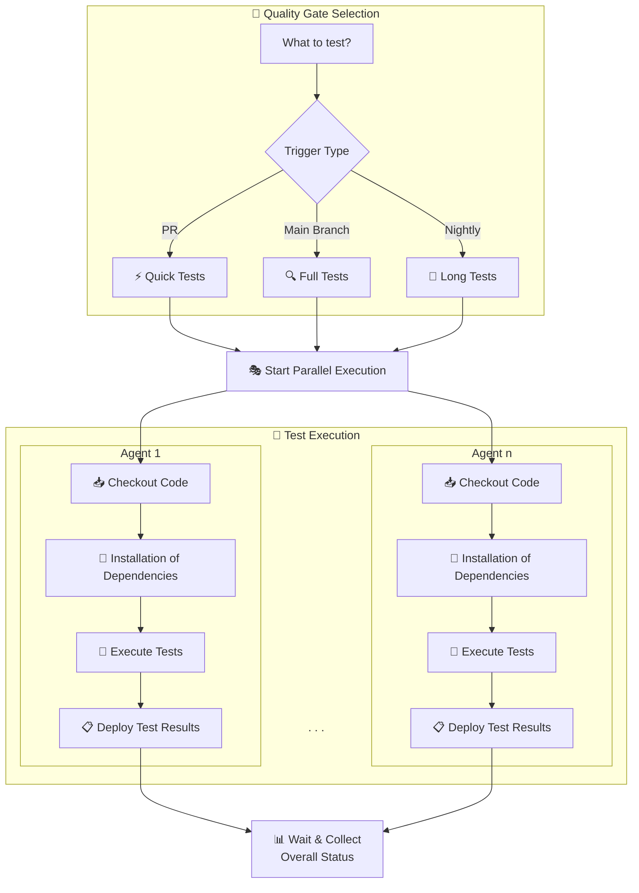

# A CI Journey: Less Pipelines, More Happy Developers

## Sprache

English

## Zielgruppe

- Software developers
- DevOps and Platform Engineers

## Voraussetzungen

You don't need any prior knowledge.
This topic is relevant for both beginners and experts in Continuous Integration (CI).
You'll probably find it useful to have a basic knowledge of CI Pipelines and Python, but it's not essential.

## Überblick und Zusammenfassung

Continuous Integration (CI) is a crucial part of modern software development, and the automotive suppliers are right behind this.
They want to offer **off-the-shelf products** with a high degree of reusability and a short time-to-market, but OEMs want **unique selling points**.
How can you make sure that your **CI pipelines** are working **efficiently** in this kind of **multi-project landscape**?
How to deliver fast, reliable and easily reproducible feedback to developers, while keeping your CI pipelines understandable and maintainable?
It's tempting to jump into pipeline technology, implement tests for quality gates on all integration levels in a pipeline's Domain-Specific Language (**DSL**) and set up complex, multi-stage pipelines with a lot of dependencies.
But this can lead to a lot of frustration, especially when you have to deal with flaky tests of nightly builds.
How many of us want to spend the next morning analyzing and debugging errors that can't be traced or reproduced?
Not us!
We want to show you how we have simplified the CI pipelines of our Software Product Line Engineering (SPLE) Platform and made them more **maintainable**, while still delivering fast feedback to developers.
We will share our experiences and lessons learned from our CI journey in the automotive industry, focusing on how we reduced the complexity of our pipelines and improved developer happiness.
**Our path to success involves clean dependency handling and comprehensible, reproducible tests for quality gates written in Python, leading to fast, incremental builds with locally reproducible results.**

## Art der Vermittlung

Talk/Presentation

## Nutzen

Discover the ups and downs of a CI journey in the automotive industry.
Learn how to build a simple, maintainable CI solution while keeping pipelines clean and understandable.
The approach highlights the separation of pipeline logic from test logic for quality gates, ensuring reproducibility and clarity.

A solution for quality gates in the SPLE Platform, built on Python, demonstrates how a structured, test-driven approach simplifies CI processes.
The advantages of using Python for writing tests will be explored, showcasing how it helps reduce complexity in CI pipelines.

## Termine

[Link to ESE Page](https://ese-kongress.de/frontend/index.php?page_id=45391)


# German Testing Days 2024

## Eine CI Reise

oder

Weniger Pipelines, Mehr Spaß!

Note:

Hallo zusammen und willkommen zu meinem Vortrag über CI/CD. Ich möchte euch heute mitnehmen auf eine Reise, die ich vor mehr als 10 Jahren begonnen habe. Eine Reise, die mich durch viele verschiedene Projekte und Firmen geführt hat. Eine Reise, die mich gelehrt hat, dass es nicht nur um Automatisierung geht, sondern auch um die Freude an der Entwicklung von Software. (Anekdote: Zurück in die Zukunft)

## Wer sind wir?

<div>


[Karsten](https://www.linkedin.com/in/karnangue/)
</div> <!-- .element: style="float: left; width: 30%" -->

<div>


[Matthias](https://www.linkedin.com/in/matthias-eggert-b7939a18a/)
</div> <!-- .element: style="float: right; width: 40%;" -->

Note:

Okay, wer sind wir eigentlich?

Matthias hat einige Jahre in der Automobilindustrie als Softwareintegrator, Softwareentwickler und DevOps Engineer gearbeitet.

Dabei ging es immer um sicherheitsrelevante Funktionen wie Bremssysteme oder Batteriemanagementsysteme.

Wir haben schon vor gut 8 Jahren bei Continental zusammengearbeitet und sind dann gleichzeitig zu Marquardt gewechselt.

Dort haben wir gemeinsam an unserer Lösung für Software-Produktlinien gearbeitet, um die es heute nur am Rande gehen wird.

Mittlerweile arbeitet er als DevOps Engineer und Testautomatisierer bei der Qytera GmbH.

Ich selbst bin seit über 18 Jahren als Softwareentwickler im Automobilbereich unterwegs.

Von Ada, Embedded C, C++, Perl, Tcl, Python über die Entwicklung von Dev Tools bis hin zu Jenkins Pipelines hab ich schon eine Menge gesehen und gemacht.

Aktuell arbeite ich als Platform Engineer im Rhein-Main-Team der Marquardt GmbH.

Dort geht es um Software-Produktlinien, interne Developer Plattformen, Automatisierung und CI/CD.

## Wo kommen wir her?

Back to 2005 <!-- .element: class="fragment" data-fragment-index="1" -->

 <!-- .element width="50%" class="fragment" data-fragment-index="1" -->

Note:

Wo kommen wir eigentlich her?

*click*

Dazu geht es etwas zurück in die Vergangenheit, genauer gesagt ins Jahr 2005.

Da hab ich als Neuling in der Automobilindustrie angefangen.

--

## Die Automobilindustrie

- Spannende Produkte <!-- .element: class="fragment" -->
- Ständig neue Anforderungen <!-- .element: class="fragment" -->
- Gut bezahlte Jobs <!-- .element: class="fragment" -->
- Das Paradies für SW Entwickler <!-- .element: class="fragment" -->

Note:

Wie war das damals in der Automobilindustrie?

Eigentlich genauso wie heute.

*click*

Spannende Produkte: Bremsensteuergeräte, ESP, ABS, ACC, ...

*click*

Ständig neue Anforderungen, da viele Kunden, die sich von der Konkurrenz abheben wollen.

*click*

Die Jobs waren gut bezahlt.

*click*

Eigentlich das Paradies für SW Entwickler.

--

## Der Job

- SW-Entwicklung für Bremsensteuergeräte <!-- .element: class="fragment" -->
- Embedded C? Das hatten wir doch an der Uni! <!-- .element: class="fragment" -->
- Es ist dein Code, aber verändere bloß nichts! <!-- .element: class="fragment" -->
- Always remember: don't break the build! <!-- .element: class="fragment" -->
- Dem Ingenieur ist nix zu schwör! <!-- .element: class="fragment" -->

Note:

Und der Job?

*click*

Klar, wir hacken Embedded C für Bremsensteuergeräte.

*click*

Kein Problem, das hatten wir doch an der Uni.

*click*

Hier kam der erste Dämpfer.

Man bekam Verantwortung für einen Teil des Codes, aber verändern sollte man ihn möglichst nicht.

*click*

Warum? Don't break the build!

*click*

Klang schwierig, aber wir hatten ja an der Uni gelernt: Dem Ingenieur ist nix zu schwör!
--

## Die Ausgangslage

- Keine Unit Tests <!-- .element: class="fragment" -->
- Ein bisschen SIL und HIL <!-- .element: class="fragment" -->
- Ganz viel Fahrversuch <!-- .element: class="fragment" -->
- Code Reuse über alle Projekte <!-- .element: class="fragment" -->
- Mehrere 100 Entwickler weltweit an einer Codebasis <!-- .element: class="fragment" -->

Note:

Die Ausgangslage?

*click*

Oha, keine Unit Tests.

Keine einige Zeile Testcode im Repository.

Klar, wo testet man Bremsen? Im Auto.

*click*

Gut, es wurde ein bisschen SIL und HIL gemacht.

*click*

Aber das meiste wurde im Fahrversuch getestet.

Viele Features waren also irgendwann, irgendwo in irgendeinem Projekt getestet.

Daher das Motto: besser nichts ändern.

*click*

Aber wie soll das gehen, wenn der Code über alle Projekte geshared ist,

alle Kunden mit neuen Anforderungen um die Ecke kommen ..

*click*

und mehrere 100 Entwickler weltweit an einer Codebasis arbeiten?


--

<!-- .slide: data-visibility="hidden" -->

## Die Tools

- MKS / PTC Integrity oder "RCS on Steroids" <!-- .element: class="fragment" -->
- GNU Make / MSYS in Java GUI auf Windows 2000 <!-- .element: class="fragment" -->
- Build Server auf ESX / VMWare <!-- .element: class="fragment" -->
  - Remote Builds <!-- .element: class="fragment" -->
  - Nightly Builds <!-- .element: class="fragment" -->

Note:
- User konnte remote Builds per GUI triggern
- Nightly Builds automatisch

--

## Continuous What?

 <!-- .element: width="40%" class="fragment" data-fragment-index="1" -->

Continuous "Kind im Brunnen" <!-- .element: class="fragment" data-fragment-index="1" -->

Note:

Wenn mich heute jemand fragt, was Continuous Integration ist, dann erinnere ich mich gerne an diese Zeit zurück.

Daran, was Continuous Integration überhaupt nicht ist.

Irgendwann ist mir ein treffender Name für die Situation damals eingefallen:

*click*

Continuous "Kind im Brunnen".

Was heißt das genau?

1. Höchstes Qualitätskriterium: SW linkbar.
2. Irgendein Projekt ist immer rot (Compile- oder Link-Fehler)
3. Keine Testautomatisierung
4. Keine Unittests
5. Entwickler sind böse, die bauen Bugs in den Code.

Und wie fühlte man sich als Entwickler dabei?

*click*

--

<!-- .slide: data-visibility="hidden" -->

## Der Prozess: ASPICE

 <!-- .element width="80%" -->

Note:
- wird nur als Last angesehen
- Entwicklung läuft richtig, da muss nichts geändert werden.
- Wer soll die ganzen Dokumente erzeugen?
- So viel Zeit haben wir gar nicht.

--

 <!-- .element width="65%" -->

Note:

Wie im Tal der Tränen.

## Wir müssen was ändern!

### Aber was?

Automotive Software Factory (2011-2021) <!-- .element: class="fragment" -->

Note:

Tja, wir müssen was ändern! Aber was?

*click*

Hier startet unsere CI Reise eigentlich erst so richtig.

Nämlich mit dem Aufbau unserer Automotive Software Factory.

Der Name kam erst später, aber Ideen gab es genug.

--

SW Änderungen nur bis 12 Uhr mittags, danach Bugfixing und Testen beim Fahrversuch.

 <!-- .element: width="40%"  class="fragment" data-fragment-index="1" -->

Note:

Eine Idee war ...

Ihr könnt euch vorstellen, wie begeistert die Entwickler waren.

*click*

Zumal sich die Frage stellt, was 12 Uhr mittags bei einem internationalen Konzern ist, der weltweit verteilt arbeitet.

Diese Idee hat nicht wirklich funktioniert.

Was kann man sonst noch machen?

--

## Unit Testing ist ein guter Anfang.

- Mit eigenem Framework basierend auf CUnit <!-- .element: class="fragment" -->
- Automatische Generierung von Mockups <!-- .element: class="fragment" -->
- Test Driven Development (TDD) <!-- .element: class="fragment" -->
- Nightly Tests auf Jenkins (und Hudson!) <!-- .element: class="fragment" -->

Note:

Klar, wenn man keine Unit Tests hat, dann ist das immer ein guter Anfang.

Allerdings war das gar nicht so einfach, unseren Code testbar zu machen.

*click*

Wir haben uns ein eigenes Framework gebaut, basierend auf CUnit.

*click*

Die automatische Generierung von Mockups war ein großer Erfolg damals.

Das händische Schreiben von Mockups (gerade in Zeiten von Autosar) war einfach zu aufwändig und eine große Hürde für die Entwickler.

*click*

Wir von Anfang an versucht, Test Driven Development basierend auf den Anforderungen zu etablieren.

*click*

Und klar, wenn man Unit Tests hat, will man die auch automatisiert ausführen.

--

## Continuous Integration klingt auch nett.

- Gerrit und Jenkins für Tools <!-- .element: class="fragment" -->
- Feature-based Testing mittels Commit-Kommentar <!-- .element: class="fragment" -->
- SW Entwicklung weiterhin auf RCS. <!-- .element: class="fragment" -->
- CI mit RCS? Yes, we can! <!-- .element: class="fragment" -->

Note:

Ja gut, wir haben einen Jenkins und ein paar Unit Tests.

Lasst uns doch mal CI machen!

*click*

...

--

## No git? <!-- .element: class="r-fit-text" -->

## No mercy! <!-- .element: class="r-fit-text fragment" style="color:red" -->

Note:

Was? Kein Git? Ihr macht CI mit RCS?

*click*

Sorry, aber dann gibt es keine Gnade!

Ihr seid auf euch alleine gestellt!

Und so war es auch. Wir sind nie von Nightly Builds weggekommen.

Unsere CI Lösung lief parallel zu nightly builds.

--

Was wir erschaffen wollten:

 <!-- .element height="60%" width="60%" -->

--

Das Monster, dass dabei rauskam:
 <!-- .element height="50%" width="50%" -->

Note:

Das Monster, dass dabei rauskam, war ein Jenkins, der alles konnte.

Der Jenkinstein.

Anstatt ein einheitliches Buildsystem incl. Pipeline zu haben, hatten wir eine Vielzahl von Jobs, die alle irgendwie zusammenhingen.

Wir missbrauchten Jenkins als Buildsystem, als Testsystem, als Deployment-System, als Monitoring-System.

All das, was unser Buildsystem nicht konnte, haben wir in Jenkins Pipelines gepackt.

--

Jenkins School of Witchcraft and Wizardry

 <!-- .element height="60%" width="60%" -->

Note:

- Die Krux mit den Jenkins Pipelines
  - Java-Entwickler, die einfach Java programmieren wollen
  - Und es dann nicht dürfen!
  - Viele Missverständnisse, was wo ausgeführt wird
  - Keiner versteht mehr, wie die Pipeline funktioniert.
  - Keiner kann debuggen.
  - Keiner kann es nachvollziehen.
  - Anti-Pattern von CI.
- 2 Scrum Teams waren zu wenigstens 50% mit Maintenance ausgelastet.
- Es ging die "Service Card" um.

--

<!-- .slide: data-visibility="hidden" -->

### Thema: Skalierbarkeit

- Klassische IT hat ESX / VMWare im Bauchladen <!-- .element: class="fragment" -->
- 500 Statische Windows Server VMs <!-- .element: class="fragment" -->
- 2 Millionen Euro in Bare-Metal versenkt <!-- .element: class="fragment" -->
- Kombination von CI/CD, Nightly Builds und on-demand Builds <!-- .element: class="fragment" -->

--

<!-- .slide: data-visibility="hidden" -->

### Die Sicht eines Anwenders:

"Meine Komponente ist so komplex und kann nur komplett im Verbund getestet werden. Ist mir egal, ob es 10 oder 100 Kundenprojekte gibt, das muss die Software Factory können."

--

<!-- .slide: data-visibility="hidden" -->

### Die Erlösung: GitHub Enterprise

- ... ist keine Erlösung. <!-- .element: class="fragment" -->
- Mono-Repo skalierte nicht. <!-- .element: class="fragment" -->
- Testaufwand für jede Änderung zu hoch. <!-- .element: class="fragment" -->
- 24/7 Auslastung der Buildagents <!-- .element: class="fragment" -->
- Teilweise mussten nightly builds auf den Vorgänger warten <!-- .element: class="fragment" -->
- Kann man bei 24h noch von nightly builds reden? <!-- .element: class="fragment" -->
- Webportal zur Anzeige der Ergebnisse der Builds (immer rot) <!-- .element: class="fragment" -->

--

<!-- .slide: data-visibility="hidden" -->

### Und was macht eigentlich die Toolabteilung?

- Tool Dependency Handling mit eigenem Paketmanager (Hack in Java) <!-- .element: class="fragment" -->
- Hybridcloud: on-premise und AWS/EC2 <!-- .element: class="fragment" -->
- 2 Scrum Teams waren zu wenigstens 50% mit Maintenance ausgelastet. <!-- .element: class="fragment" -->
- Es ging die "Service Card" um. <!-- .element: class="fragment" -->
- GitHub Enterprise Instanz andauernd am Limit. <!-- .element: class="fragment" -->

## Was haben wir eigentlich alles falsch gemacht?

Note:

Zunächst lief alles gut ...

--

## Freestyle Happiness

 <!-- .element width="80%" -->

Note:

Klar, wenn man mit Jenkins startet, geht es mit einfachen freestyle jobs los.

Einfach nur bauen.

--

## Freestyle Faith

<div style="position:relative; width:900px; height:600px; margin:0 auto;">
    
    
</div>

Note:

- dann passiert plötzlich doch ein bisschen mehr
- nach und nach müssen Tools zusammengeklebt werden
- Anbindung ans SCM System
- Reporting

--

## Holy Moly Groovy Pipelines

 <!-- .element width="80%" -->

--

 <!-- .element width="65%" -->

Note:
Höher, schneller, weiter: Eine Pipeline, um sie alle zu knechten.

--

## Law of the Instrument

- Pipeline als Ersatzbuildsystem <!-- .element: class="fragment" -->
- Buildlogik in Pipelines (10000e Zeilen Groovy DSL) <!-- .element: class="fragment" -->
- Ausreichend? Nein! Shared Libraries und Plugins gibt es ja auch noch ... <!-- .element: class="fragment" -->
- Nicht nachvollziehbare CI Ergebnisse <!-- .element: class="fragment" -->
- Worst case: getrennte Repos für Produkt Source Code und CI Pipeline <!-- .element: class="fragment" -->

Note:

- CI-System macht andere/mehr Sachen als die Buildumgebung.
- Mit dem Hammer in der Hand sieht die Welt wie ein Haufen von Nägeln aus.
- Birmingham screwdriver

--

## Continuous Complexity

 <!-- .element width="60%" style="filter: invert(100%)" -->

## Wie geht es besser?

* Ein Meta-Buildsystem (z.B.: CMake)  <!-- .element: class="fragment" -->
* Ein richtig schnelles Buildsystem für C/C++ (ninja) <!-- .element: class="fragment" -->
* Mittels Bootstrapping alle Dependencies <!-- .element: class="fragment" -->
* Andere Git Repos via Cmake's Fetch_Content() <!-- .element: class="fragment" -->
* Pipeline als Code im Repo <!-- .element: class="fragment" -->

Note:

Okay, wie geht es denn nun besser?

*click*

Naja, auf jeden Fall braucht man ein Buildsystemgenerator, der die Abhängigkeiten auflöst und die Buildfiles generiert.

CMake ist da aus unserer Sicht ein guter Kandidat.

Man braucht schon irgendeine Art von Pipeline, aber nur als Steuerung des Build Systems.

Kein CI Only Code

--

<!-- .slide: data-visibility="hidden" -->

## SPLE Plattform

* VSCode plus CMake Tools
* Konfiguration as Code
* Einfach Erweiterbar
* SPLE ermöglicht modulare SW Entwicklung
* Komponenten als Bausteine der Software
* Separate Repositories dank RTE Schnittstellen
* Eigene Konfiguration
* Variantenunabhängige Unittests
* Trennung von Kunden- und Entwicklersicht
* Integrationstests der Komponenten möglich

--

## Jenkins

* macht NICHTS anders als der User lokal <!-- .element: class="fragment" -->
* Build ist ein One-Liner <!-- .element: class="fragment" -->
* Automatische Joberzeugung für Branches und Pull Requests <!-- .element: class="fragment" -->
* Wenige Plugins zum Anzeigen von Ergebnissen <!-- .element: class="fragment" -->
* Unterstützung der Entwickler bei Analyse von Fehlern <!-- .element: class="fragment" -->

Note:

- https://www.jenkins.io/doc/book/pipeline/pipeline-best-practices/
- Minimaler Jenkinsfile plus Organisation Folder Plugin (Bitbucket, GitHub)
- Ein einziger Konfigfile (config.xml der Orga)

--

<!-- .slide: data-visibility="hidden" -->

## Reporting

* Weniger ist mehr
* Keine Datenbank
* Kein Ergebnisportal selber stricken
* Jenkins + Artifactory und gut

--

## Pipeline Happiness

 <!-- .element height="80%" width="80%" -->

--

 <!-- .element height="65%" width="65%" -->


---

 <!-- .element height="48%" width="48%" -->

---

 <!-- .element height="40%" width="40%" -->
https://xxthunder.github.io/GermanTestingDay2024/


## Brainstorming

### CI vs. Local


Let us focus on the differences between CI and local environments.

#### Trigger

- CI: push to main branch, pull request, nightly build
- Local: command line, GUI

#### Pipeline

**Local**

1. Clone repository
2. Install dependencies (e.g., tools, external libraries)
3. Build (variant(s))
4. Report?

**CI**

1. Check trigger and determine what quality gate to run
    - pull request -> run quick quality gate
    - push to develop branch -> run full quality gate
    - nightly build -> run long-running tests
2. Nodes orchestration (start different builds in parallel on different nodes)
    1. Clone repository
    2. Install dependencies (e.g., tools, external libraries)
    3. Build (variant(s))
    4. Generate reports
3. Wait for all nodes to finish and collect results
4. Report

### Journey

#### What we had

20 years ago we started with the first CI pipelines for our software platform:

- **R1** Source code repository (not git) for the product line with all variants
- **R2** Proprietary build automation server (Smoke Tester - remote build)
- no unit tests
- static code analysis
- software in the loop
- hardware in the loop
- vehicle tests
- code reuse
- hundreds of developers

15 years ago

- proprietary unit test framework
- Jenkins(Hudson) for CI
   - nightly builds for all variants to run the unit tests

Then all departments wanted to have the automation too.
Solution: freestyle jobs for every test level or test tool.

- Unit test jobs
- SIL jobs
- Build jobs


But no quality gate and no continuous integration.


12 years ago

- **R1** Source code repository (not git) for the product line with all variants
- **R2** Git Repository for the CI configuration
    - json files to configure the Jenkins pipeline for the product line
- **R3** Jenkins job DSL to implement the pipeline logic
    - clone **R2** repository
    - parse json files
    - schedule build jobs for all variants in parallel based on the json configuration
- **R4** Flight Board
    - web interface to show the build status of all variants in real-time
    - search, filter and download build artifacts for every "flight"
    - asynchronously append build result to flights (e.g., when a long-running hardware integration test is finished)
- **R5** Eclipse based build system generator
    - focus was on GUI for developers
    - generated build system (Makefiles)

**Trigger**

Every night start the builds for all SPL variants configured in the **R2** repository.

Why not for every pull request?
It took too much time and slowed down the development.

If one focuses on the nightly builds, then you need reports and status monitoring.

- public build status
- flight board


####


#### What we have now

TODO


### About the article

- how do we want to present the CI **journey**?
- add maybe a section for next steps to be done. What is still missing?


## Tagungsbandbeitrag

## Leitfaden

[Link to ESE Guideline](https://ese-kongress.de/frontend/index.php?page_id=45396)

Leitfaden zur formalen Gestaltung eines Tagungsband-Beitrags
Gelebte Tradition und gute Praxis ist es, dass Vortragende begleitend zu ihrem Vortrag einen Autorenbeitrag zum Tagungsband des ESE Kongress beitragen. Ziel ist es, dem Leser ein hochwertiges, nachhaltiges digitales Begleitbuch während des Kongresses oder für die Nachlese zu bieten.

Im Folgenden finden Sie Hinweise zur Gestaltung Ihres Autorenbeitrags. Mit der Einhaltung dieser Vorgaben sowie der Termine unterstützen Sie uns in diesem Ziel und erleichtern uns die Verarbeitung Ihres Artikels.

Herzlichen Dank im Voraus für Ihre Unterstützung.

Download:
Beispiel (PDF) -  Beispielmanuskript Tagungsband-Beitrag

Wichtige Termine
Bis spätestens 12. Oktober:
Prosatext (Word Doc) für Tagungsband - NUR für Vorträge, nicht für Seminare

Wichtig für die Organisation
Unsere Prozesse sind automatisiert. Bitte laden Sie daher Ihren Beitrag für das Tagungsband (Word-Doc) direkt in unsere Referenten-Datenbank. Verwenden Sie hierzu das Log-in

Senden Sie uns das Material nicht per E-Mail!

Formale Kriterien für Ihren Autorenbeitrag
Umfang
Text gesamt ca. 7.000 bis 12.000 Zeichen (inkl. Leerzeichen). Falls Sie darüber hinaus ausführlichere oder ergänzende Texte z.B. als Download zur Verfügung stellen wollen, geben Sie diese bitte als Bezugsquelle an.

Qualität
Bitte liefern Sie für den Tagungsband einen hochwertigen Fachbeitrag aus der Praxis oder einen fundierten wissenschaftlichen Beitrag, wie Sie ihn selbst in einem professionellen Tagungsband erwarten würden (keine Werbung, kein Marketing, keine Produktvorstellung).

Sprache
Deutsch oder Englisch

Dateiformat
Word

Layout
Um ein einheitliches Layout zu gewährleisten, stellen Sie bitte vor Beginn der Schreibarbeit folgende Parameter ein:

Papierformat: DIN A4 hoch
Ränder:
2 cm oben
3 cm unten
3 cm links
3 cm rechts
Gestaltungsraster Satzspiegel (Seitenlayout): einspaltig, Blocksatz
Zeilenabstand: mehrfach 1,15
Schrifttypen der einzelnen Textelemente:
Überschrift/ Titel: Times New Roman, 16 pt bold
Untertitel: Times New Roman, 12 pt bold
Vorspann: Times New Roman, 12 pt bold
Fließtext: Times New Roman, 12 pt
Zwischenüberschrift: Times New Roman, 12 pt bold
Bild-/Tabellenbeschriftung: Times New Roman, 12 pt
Hervorhebungen im Text: kursiv - bitte sparsam und nur falls wirklich notwendig!
Formatierungen: Vermeiden Sie im Fließtext jegliche Formatierungen wie
automatische Absatznummerierungen
Einrückungen
Fettdruck, Unterstreichungen, Farbmarkierungen etc.
Verzichten Sie bitte unbedingt auf
Kopf-/Fußzeilen
Seitennummerierungen
Logos
Bilder und Tabellen
Direkt im Text platzieren (keine separaten Grafikdateien)
Fortlaufend nummerieren
Immer mit erklärender Bildunterschrift versehen
Bild-/Tabellenbeschriftung: Times New Roman, 12 pt
Wichtig: Versehen Sie alle Bilder/Grafiken mit einer Quellenangabe!
Darstellung: Verzichten Sie auf dunklen Hintergrund und achten Sie auf hohe Kontraste.
Achten Sie insgesamt auf eine hohe grafische Qualität bzw. Auflösung (300 dpi).
Formeln, Codebeispiele etc.
Bevorzugt als Bild einbetten
Empfohlener Schrifttyp: Fixschrift, z.B. Courier bzw. Courier New
Schriftgröße: 12 pt
Inhalt
Typische Elemente des Autorenbeitrags
Überschrift
Optional: Untertitel
Autorenname(n), Name der Firma/des Instituts
Vorspann: Problemstellung, Fragestellung, Zielsetzung des Beitrags (1 Absatz)
Hauptteil (ca. 10.000 Zeichen)
Einführung in die Problemstellung, Rahmenbedingungen, Hintergründe, Fragestellung
Theoretische Grundlagen und Begriffe kurz, soweit nötig
Lösungsansätze, Prinzipien, Zusammenhänge
Ergebnisse, Nutzen, Vor- und Nachteile, Randbedingungen
Beispiele
Zusammenfassung, kritische Würdigung, offene Fragestellungen, Ausblick, Empfehlungen
Optional: Symbol-/ Abkürzungsverzeichnis
Optional: Quellen- und Literaturverzeichnis
Kurzbiografie Autor(en): Name, Firma, Funktion, fachliche Schwerpunkte oder Interessen etc.
Optional: Autorenbild

---

## Conference Proceedings Contribution

### Introduction

Continuous Integration (CI) and Platform Engineering are crucial in modern software development.
The automotive industry is no exception.
Automotive suppliers want to offer off-the-shelf products with high automation and short time-to-market, while OEMs demand unique selling points and different development process requirements.
The automotive industry's complex multi-tool landscape includes various V-Model test levels [1], numerous standards and regulations [2], each with their own tools and frameworks.
This raises a critical question: How can we ensure CI pipelines work efficiently while delivering fast, reliable feedback and maintaining understandability?
In this talk, we present our approach of an Internal Developer Platform (IDP) [3] for Software Product Line Engineering (SPLE) [4], built on Python [5], CMake [6] and Jenkins [7].
We share lessons learned from our CI journey, focusing on reduced pipeline complexity and improved developer happiness through clean dependency handling, unified build systems, and reproducible Pytest-based quality gates that work identically on developer machines and in CI environments.

### Our CI Journey

Our CI journey spans over two decades, beginning in 2005 in the automotive industry where we encountered what we now call "Continuous Kind im Brunnen" (Continuous "Child in the Well") - a reactive approach where the only quality criterion was simply "software linkable" and developers only received feedback the next day after nightly builds failed. Starting with an RCS-based source code repository supporting hundreds of developers across multiple customer projects, we relied on a proprietary build automation server for remote builds, with no unit tests and testing primarily conducted through integration tests and vehicle trials.

Our first improvement attempt introduced unit testing with a custom CUnit-based framework and Jenkins, but we made the critical mistake of creating a separate build environment instead of integrating with existing infrastructure. As other departments demanded automation, we implemented freestyle jobs for every test level (Software-In-the-Loop, Hardware-In-the-Loop, etc.), creating a fragmented landscape without true continuous integration or quality gates

The evolution continued with centralizing CI configuration in a separate Git repository containing JSON files to orchestrate Jenkins pipelines, followed by migrating to GitHub Enterprise for webhook-driven triggers. However, this led to our biggest architectural mistake: implementing all quality gate business logic within Jenkins pipeline DSL (Groovy), creating thousands of lines of complex, unmaintainable code that became our "Jenkinstein" - a monster that served as build system, test system, deployment system, and monitoring system all in one.

The breaking point came when we realized the fundamental flaw: build failures were non-reproducible locally, debugging was nearly impossible, and two Scrum teams spent 50% of their time on maintenance. This led to our architectural renaissance, where we established clear separation between pipeline orchestration, test logic for quality gates, and the build system itself.

### Our Solution

Our solution addresses the core problem of CI/local environment mismatch through clear architectural separation and unified tooling.
The key insight was recognizing that CI and local environments differ primarily in orchestration, not in actual build and test execution.
With this understanding, we derived the following **architecture principles**:

- **Separation of Concerns**: Pipeline logic handles only orchestration; all business logic resides in the build system
- **Local-First Development**: Jenkins executes identical commands that developers run locally
- **Bootstrapping**: build scripts handle all dependency resolution and tool installation
- **Unified Build System**: CMake as meta-build system with ninja for performance, building all artifacts of all variants
- **Quality Gates**: Pytest as universal test framework for all quality gates, executing and testing all required build targets

With these principles in mind, we designed a modular Internal Developer Platform (IDP) for Software Product Line Engineering (SPLE).
We named our approach SPLE Platform with the goal to supporting the following **Main Features**:

- **Shift Left**: Tests as early as possible in the development process
- **Continuous Integration**: Fast feedback on pull requests and develop branch
- **Reuse**: Support for multiple customer projects with shared components and variant management
- **Automation**: Automated creation of all required build artifacts and reports

Our SPLE Platform provides a modular software development environment with an **Implementation Stack** consisting of:

- **Scoop** [8]: Windows package manager for toolchain installation
- **CMake + Ninja**: Build system generator and fast build system
- **Python + Pytest**: Unified test framework with markers for different quality gate types (@pytest.mark.build, @pytest.mark.unittests)
- **Thin Jenkins Pipeline**: Minimal orchestration calling pytest with appropriate markers based on trigger type
- **Quality Gates as Test Selection**: Each quality gate is simply a pytest marker selection (quick for pull requests, full for develop branch, extended for nightly)

To illustrate our approach of quality gates, Figure 1 shows a flow chart of our unified SPLE pipeline with quality gate selection and test execution.
This pipeline simply selects a quality gate as set of markers based on the trigger type (pull request, main branch push, nightly build) and orchestrates parallel execution across multiple agents.



Here is an example of how we structure tests for a variant "MyVariant" as a Pytest class using markers:

```python
class Test_MyVariant:
    variant = "MyVariant"

    @pytest.mark.build
    def test_build(self):
        # Arrange
        spl_build: SplBuild = SplBuild(variant=self.variant, build_kit="prod", target="build")

        # Act
        result = spl_build.execute()

        # Assert
        assert result == 0, "Building failed"

    @pytest.mark.unittests
    def test_unittests(self):
        # Arrange
        spl_build: SplBuild = SplBuild(variant=self.variant, build_kit="test", target="unittests")

        # Act
        result = spl_build.execute()

        # Assert
        assert result == 0, "Building failed"
```

This approach transforms quality gates from opaque pipeline magic into transparent, reproducible test selections that work identically across all environments.

Another key insight was to treat the platform itself as a **product**, developed collaboratively within an **Agile Release Train** following the **Scaled Agile Framework (SAFe)** [9]. This marked a major shift from fragmented, tool-specific automation efforts to a unified, organization-wide initiative.

By coining a clear name and vision for the platform, we gave all contributors, from developers to platform engineers and management, a shared sense of ownership.
Every team now contributes features, feedback, and improvements through regular sprint reviews, ensuring the platform evolves with real user needs.

Management actively supports the initiative from a business perspective by allocating dedicated budgets for training, licenses, and infrastructure.
This alignment between technical teams and leadership transforms the platform from an ad-hoc engineering effort into a sustainable, strategic product that integrates seamlessly across all tools and test levels.

### Conclusion

With the presented solution of a modular SPLE Platform built on Python, CMake, and Jenkins, we have successfully transformed our CI journey from a fragmented, unmaintainable "Jenkinstein" into a streamlined, developer-friendly environment that delivers fast, reliable feedback across all test levels. The main benefits realized through this approach for different stakeholders include:

- **Developers**: Same commands work locally and in CI; easy debugging of failures; fast feedback
- **Platform Engineers**: Maintainable Python code instead of complex DSL; reusable components across SPLs
- **Management**: Fast, reliable feedback; transparent quality criteria; always releasable software state

### References

[1] ASPICE: https://vda-qmc.de/en/automotive-spice/

[2] ISO26262: https://en.wikipedia.org/wiki/ISO_26262

[3] Internal Developer Platform (IDP): https://en.wikipedia.org/wiki/Internal_developer_platform

[4] Software Product Line Engineering (SPLE): https://en.wikipedia.org/wiki/Software_product_line

[5] Pytest: https://docs.pytest.org/en/

[6] CMake: https://cmake.org/

[7] Jenkins: https://www.jenkins.io/

[8] Scoop: https://scoop.sh/

[9] Scaled Agile Framework (SAFe): https://www.scaledagileframework.com/
